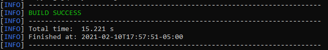
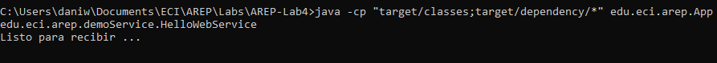
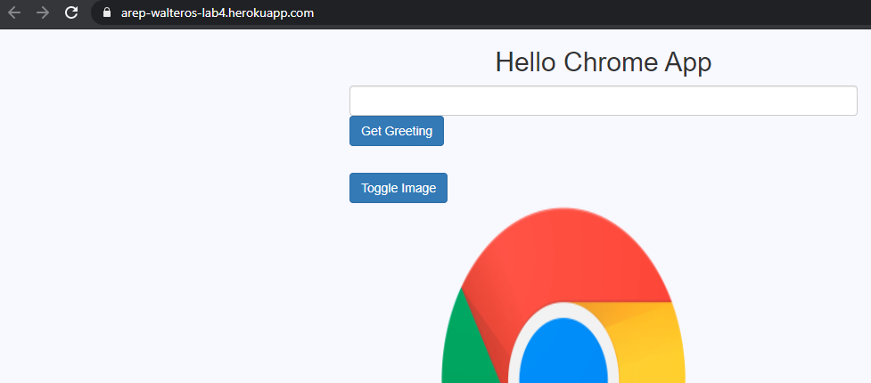
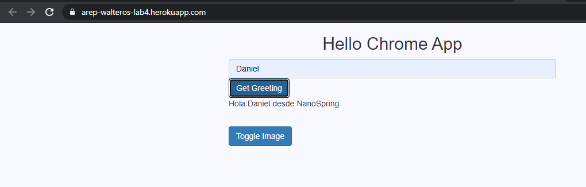
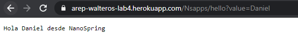
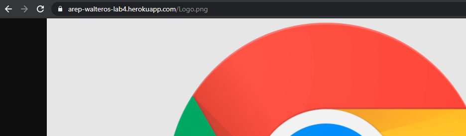
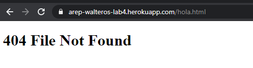
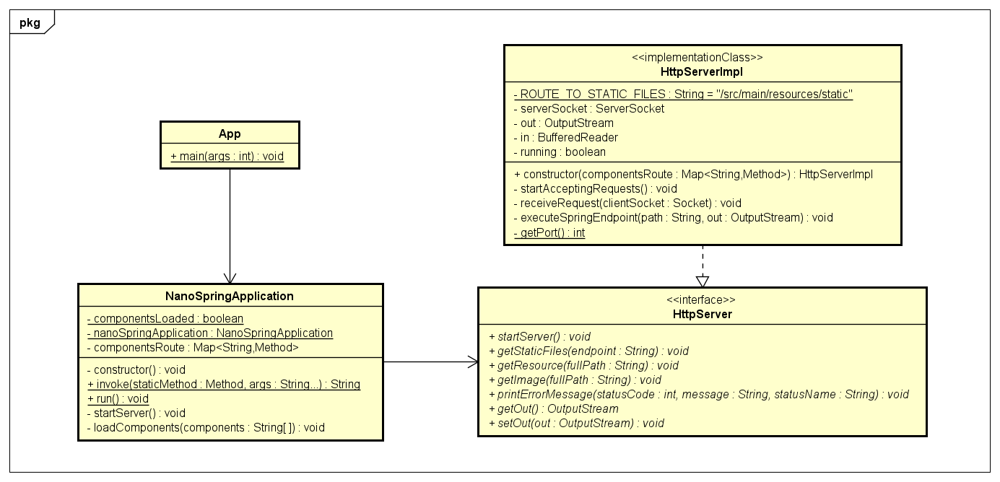

# Taller Clientes Y Servicios

Fecha: Viernes, 12 de Febrero del 2021

Cuarto Laboratorio de Arquitecturas Empresariales (AREP).

## INTRO

## Contenido

  - [Prerrequisitos](#prerrequisitos)
  - [Compilar](#compilar)
  - [Ejecutar](#ejecutar-de-forma-local)
  - [Uso](#uso)
  - [Diagramas](#diagramas)
  - [Resultados de las Pruebas](#resultados-de-las-pruebas)
  - [Generación de Javadoc](#generación-de-javadoc)
  - [Documentación en PDF realizada en LATEX](#documentación-en-PDF-realizada-en-LATEX)
  - [Autor](#autor)
  - [Licencia](#licencia)

## Prerrequisitos

Para el desarrollo del proyecto se utilizó **Maven** como una herramienta para la construcción y gestión del mismo, el código fue desarrollado con el lenguaje de programación **Java**; por lo tanto se requiere para su ejecución tener estas dos herramientas en las versiones especificadas a continuación.

  - Java versión 8 o superior
  
  - Maven versión 3.5 o superior 
    
## Compilar

Después de descargar o clonar el proyecto se debe utilizar el comando `mvn package` para generar el ejecutable .jar con los .class compilados.

## Ejecutar de forma local

Para utilizar el programa se debe haber realizado previamente la compilación del ejecutable .jar y de los archivos .class, una vez se haya realizado esto se usa el comando `java -cp <classpath> edu.eci.arep.App <filepath>`.

Donde `classpath` es la ruta hacia el .jar o hacia la carpeta donde se encuentran los archivos .class y `filepath` es la ruta del archivo del cual se lee el conjunto de números.

**Para mejorar la lectura de los resultados, estos se redondearon a dos cifras decimales**

#### Ejecución con .jar

Se utilizó el comando `java -cp "target/areplab3-1.0-SNAPSHOT.jar;target/dependency/*" edu.eci.arep.App`.

#### Ejecución con .class

Se utilizó el comando `java -cp "target/classes;target/dependency/*" edu.eci.arep.App`.

Después de realizar la ejecución de cualquiera de las dos formas, se accede de forma local abriendo un web browser y dirigiéndose a la dirección http://localhost:35000.

## Uso

Para hacer uso de la aplicación se debe realizar lo siguiente:

1.  Abrir la aplicación de forma local o remota y escribir números separados por coma.

    URL Aplicación ejecutada de forma Local: http://localhost:35000

    URL Aplicación alojada de forma Remota con Heroku: https://arep-walteros-lab3.herokuapp.com/
    
    
    
    Esta pagina HTML contiene una imagen PNG y utiliza un archivo JS, estos son los tres tipos de archivos estáticos que tolera el servidor.
    
2.  Al hacer click en el botón `Toogle Image` la imagen desaparecerá.

    

3.  Si escribes en el cuadro de texto y haces click en el botón `Get Greeting` recibirás un saludo con el nombre que pusiste.

    
    
    Esta función utiliza al endpoint `/Apps/hello?value=Daniel` generada con el framework propio NanoSpark.
    
4.  Para acceder directamente a este endpoint basta con poner ese valor en la URL.

    
    
5.  El servidor retorna archivos estáticos con las extensiones js,png y html.
      
    
    
    
    
    
    
6.  En caso de que los archivos no existan se visualizará lo siguiente:

    

## Diagramas

El programa principal utiliza la interfaz **HttpServer** para crear por medio de sockets un servidor sobre el cual corre una aplicación web, la implementación de esta interfaz utiliza la interfaz **PersitenceService** para acceder a la base de datos firebase y para simular le comportamineto del framework Spark tiene un atributo de la interfaz **NanoSpark**.

La interfaz **NanoSpark** usa el metodo get para definir endpoints como Spark y tanto la implementación de las funciones lambda como su ejecución se realizaron por medio de la interfaz Funcional **BiFunction**. El almacenamiento de los diversos endpoints se realizó por medio de un hashmap y cada vez que llega una solicitud al servidor se valida contra los endpoints establecidos.

Una gran ventaja de esta arquitecura es que al desacoplar las funcionalidades con interfaces se pueden realizar cambios o extensiones sin afectar otras capas del modelo, solo basta con crear una clase que implemente la interfaz respectiva y asignarla en la clase que la utiliza.

La aplicación se divide en tres componentes principales, FrontEnd, BackEnd y FirebaseDB.

El componente más funcional de FrontEnd es **App**, este es el que lee la información que registra el ususario y por medio de Axios accede a **HttpServer** para usar el endpoint definido en NanoSpark.

La función lambda con la que se configuró este endpoint permite conectarse al componente **PersistenceServiceImpl**, este se conecta la base de datos Firebase para obtener el saludo que retorna junto con el nombre del usuario.

Debido a que utilizando que la aplicación desarrollada intenta emular el comportamiento la herramienta Spark, su naturaleza es la de una aplicación web, cualquier persona con conexión a internet puede acceder a la aplicación desplegada, la interacción del cliente con el servidor se realiza únicamente por el protocolo HTTP; por otra parte, la conexión del servidor con la base de datos firebase se realiza por el protocolo HTTPS.  

## Resultados de las Pruebas

El programa fue probado con seis pruebas unitarias de JUnit donde se contemplaron los siguientes casos:

  - Búsqueda de un archivo HTML.
  - Búsqueda de un archivo PNG.
  - Búsqueda de un archivo JS.
  - Búsqueda de un archivo inexistente.
  - Uso de Endpoint Generado Con NanoSpark.
  - Fallo Por Uso Erróneo de Endpoint Generado Con NanoSpark.

Los resultados de las pruebas se pueden visualizar al utilizar el comando `mvn package` o el comando `mvn test`.

## Generación de Javadoc

Para generar la documentación de Java se utiliza el comando `mvn javadoc:javadoc`, la documentación se almacenará en el directorio `target/site/apidocs`.

**La documentación de Java de este proyecto se encuentra previamente en la carpeta docs/apidocs**

**Adicionalmente se puede acceder a una visualización de esta documentación accediendo a este [ENLACE](https://silenrate.github.io/AREP-Lab3/apidocs/)**

## Documentación en PDF realizada en LATEX

[Taller Clientes Y Servicios](TallerClientesYServicios.pdf)

## Autor

  - **Daniel Felipe Walteros Trujillo**

## Licencia

Este proyecto está licenciado bajo la licencia **General Public License v3.0**, revise el archivo [LICENSE](LICENSE) para más detalles.
